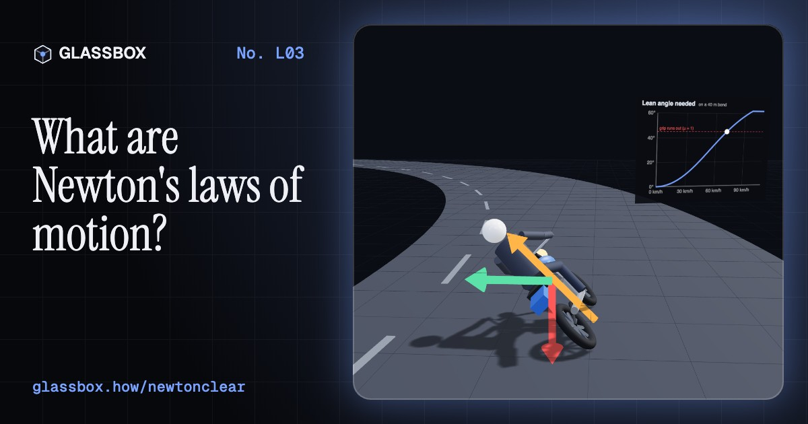
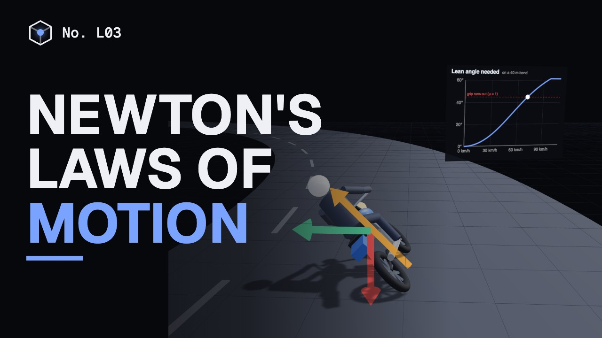
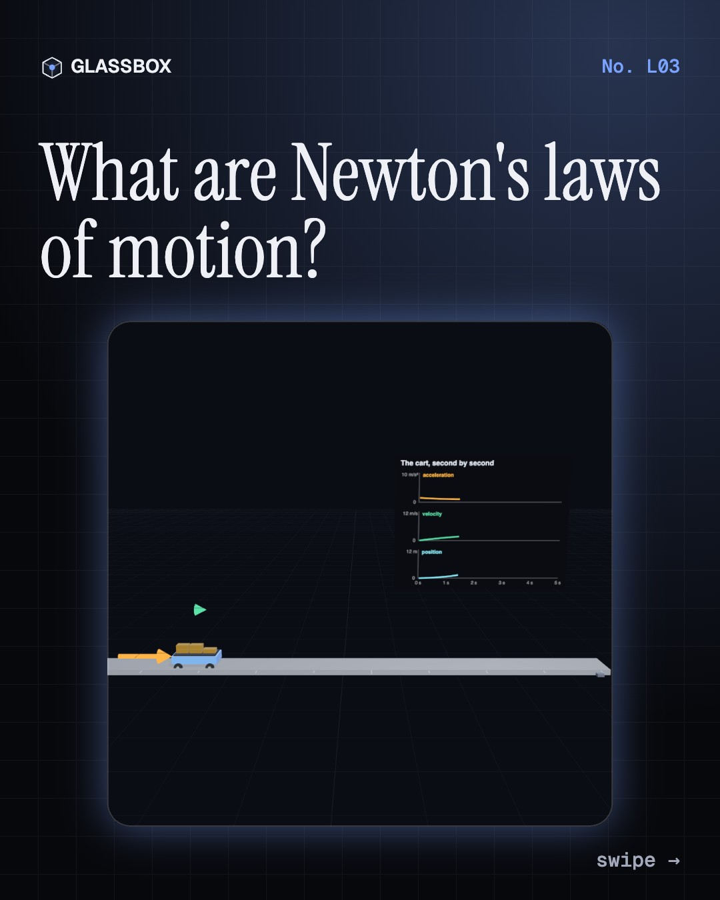
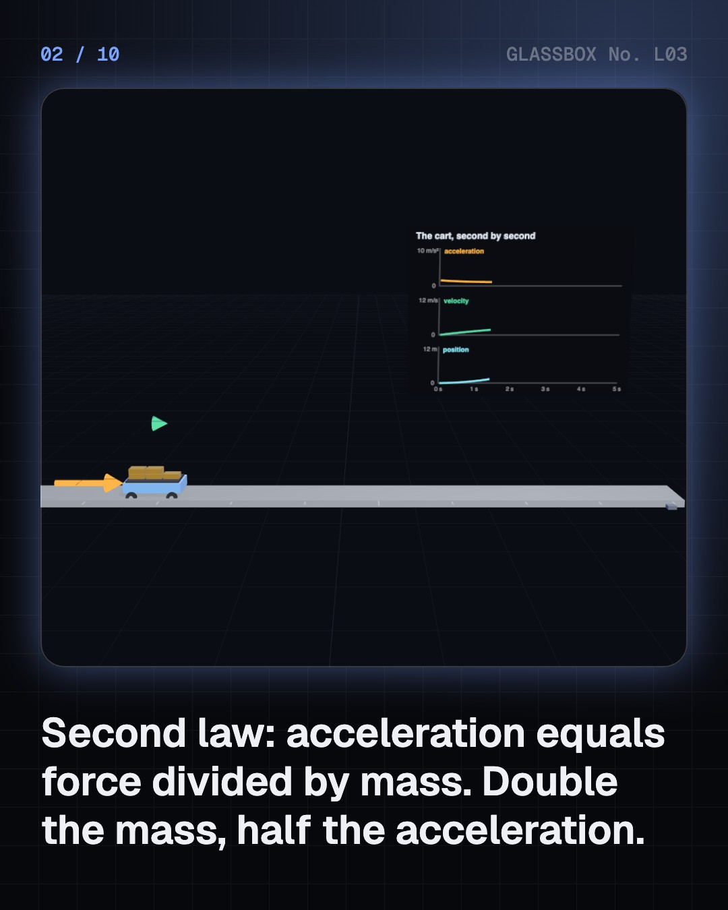
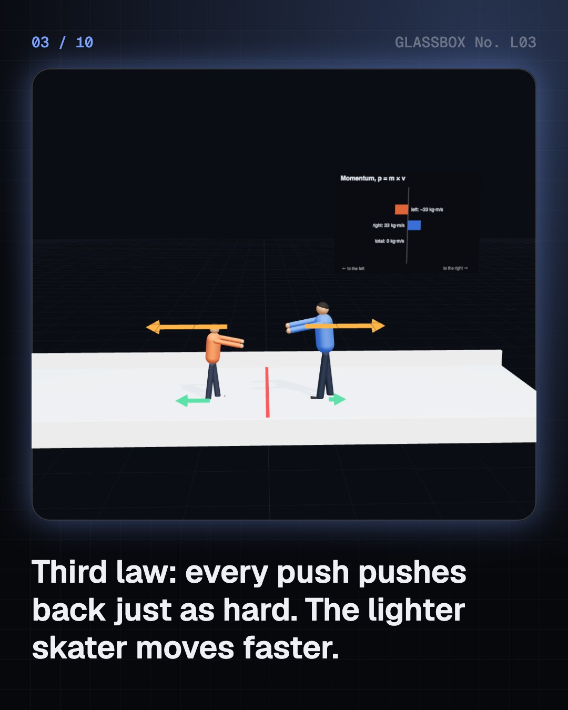
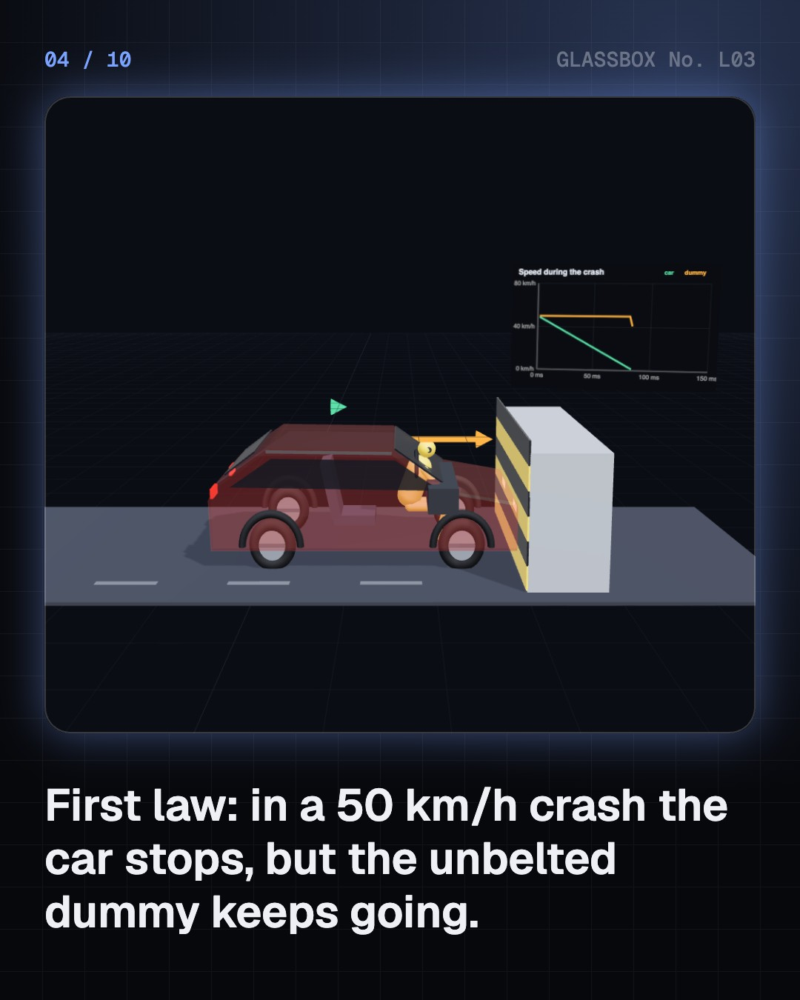

<!-- glassbox:start -->
<!-- Generated from glassbox.json by the Glassbox hub (npm run readme -- newtonclear). Edit glassbox.json, not this block. -->
<p align="center"><a href="https://glassbox.how/e/newtonclear/"></a></p>

<h1 align="center">Newton's laws of motion</h1>

<p align="center"><b>What are Newton's laws of motion?</b><br>Three rules written in 1687 still run every car, fan, dishwasher and spacecraft. Push a puck on frictionless ice, crash-test a car with and without a seat belt, race a car against a motorcycle, and find out where Newton finally breaks.</p>

<p align="center"><a href="https://glassbox.how/newtonclear/"><b>▶ Play with it</b></a> &nbsp;·&nbsp; <a href="https://glassbox.how/e/newtonclear/">Read the 60-second explainer</a> &nbsp;·&nbsp; <a href="https://glassbox.how/newtonclear/glassbox/reel.mp4">Watch the 40-second video</a></p>

<p align="center">
  <a href="https://glassbox.how/e/newtonclear/"></a>
  <a href="https://glassbox.how/e/newtonclear/"></a>
  <a href="LICENSE"></a>
  <a href="LICENSE-CONTENT.md"></a>
  <a href="#privacy"></a>
</p>

## In 60 seconds

1. **Three rules for motion.** Things keep still or keep moving in a straight line unless a force acts (inertia). A force makes them accelerate: a = F ÷ m. And forces come in pairs: push on something and it pushes back just as hard.
2. **You keep going when the car stops.** In a crash the car stops in under a tenth of a second, but you carry on. A seat belt stretches your stop over about 90 cm; without one you stop in centimetres against the wheel, with more than ten times the force.
3. **Force, mass and power on the road.** Off the line a car and a motorcycle accelerate about the same, around 5 m/s². Once moving, power-to-weight decides who pulls away. Turning needs a sideways push too, m v² ÷ r, which is why riders lean.
4. **Every push pushes back.** A dishwasher's spray arm spins because its slanted jets push it round. A fan throws air forward and is pushed back, and a rocket throws its exhaust out behind and is thrown forward, even in space.
5. **Where Newton breaks.** Near light speed momentum is γmv, not mv; inside atoms quantum mechanics takes over; in a spinning drum a fake centrifugal force appears. And heavy things don't fall faster: on the Moon, a hammer and a feather land together.

## Words worth knowing

| Term | Meaning |
|---|---|
| **Inertia** | The way matter resists any change in its motion. More mass means more inertia. |
| **Force** | A push or a pull, measured in newtons. One newton gives 1 kg an extra 1 m/s every second. |
| **Acceleration** | How quickly velocity changes, in m/s every second. Turning is acceleration too. |
| **Momentum** | Mass × velocity. Forces change it, and in any push between two things it is shared, never lost. |
| **Impulse** | Force × time, equal to the change in momentum. A longer stop needs a smaller force. |
| **Action–reaction pair** | Two equal and opposite forces that two objects exert on each other. |
| **Centripetal force** | The push towards the centre that keeps anything moving in a circle: m v² ÷ r. |
| **Inertial frame** | A point of view that isn't accelerating or spinning, where Newton's laws hold as written. |

## A short history

**From Aristotle's 'everything needs a pusher' to a hammer and a feather falling side by side on the Moon: 2,300 years of working out why things move.**

- **350 BCE** · Everything needs a mover (Aristotle, Athens, Greece)
- **1638** · Balls rolling down ramps (Galileo Galilei, Published in Leiden, Dutch Republic)
- **1644** · Straight on, for ever (René Descartes, Amsterdam, Dutch Republic)
- **1687** · The Principia (Isaac Newton, with Edmond Halley, London, England)
- **1750** · F = ma becomes an equation (Leonhard Euler, Berlin)
- **1903** · The rocket equation (Konstantin Tsiolkovsky, Kaluga)
- **1948** · A unit called the newton (9th General Conference on Weights and Measures, Sèvres, near Paris)
- **1971** · A hammer and a feather on the Moon (David Scott, Apollo 15, Hadley–Apennine landing site, the Moon)

The full story, with 20 moments, charts, people and 26 sources: [glassbox.how/e/newtonclear/history](https://glassbox.how/e/newtonclear/history/). The data lives in [`history.json`](history.json).

## Video and slides

Made with the Glassbox studio from this box's storyboard (`window.glassbox.director`). Free to reuse under CC BY 4.0.

<a href="https://glassbox.how/newtonclear/glassbox/video.mp4"></a>

<p><a href="glassbox/slide-1.jpg"></a> <a href="glassbox/slide-2.jpg"></a> <a href="glassbox/slide-3.jpg"></a> <a href="glassbox/slide-4.jpg"></a></p>

| File | What | Size |
|---|---|---|
| [`glassbox/reel.mp4`](https://glassbox.how/newtonclear/glassbox/reel.mp4) | Reel / Short, with captions and soundtrack | 1080×1920 |
| [`glassbox/video.mp4`](https://glassbox.how/newtonclear/glassbox/video.mp4) | YouTube video, with captions and soundtrack | 1920×1080 |
| `glassbox/slide-1…10.jpg` | Instagram carousel | 1080×1350 |
| `glassbox/thumb.jpg` | YouTube thumbnail | 1280×720 |
| `glassbox/cover.jpg` | Share card and repo social preview | 1200×630 |
| [`glassbox/history-reel.mp4`](https://glassbox.how/newtonclear/glassbox/history-reel.mp4) | “History in 10 moments” Reel / Short | 1080×1920 |
| `glassbox/history-slide-*.jpg` | History carousel | 1080×1350 |
| `glassbox/post.json` | Post copy and schedule used by the publish kit | |

## Privacy

This box has no accounts and no ads, and it ships its own fonts and libraries. When you run it yourself it sends nothing anywhere. On glassbox.how, the site's `/bar.js` also loads Glassbox's analytics: **Google Analytics** to count visits (it asks first in the EU, UK and Switzerland, and stays off when your browser sends Global Privacy Control or Do Not Track) and **ClickTrust** to detect bots.

It remembers a few things **in your own browser only**, and never sends them anywhere:

| Browser storage key | What it holds |
|---|---|
| `newtonclear.v1` | Which chapters you have opened, your best quiz scores, and sound on or off. |

Exactly what each one sees is at [glassbox.how/privacy](https://glassbox.how/privacy/).

## Licences

- **Code:** [MIT](LICENSE). Use it, change it, ship it.
- **Explanations, text, images and videos** (`glassbox.json`, `glassbox/`): [CC BY 4.0](LICENSE-CONTENT.md). Credit “Glassbox, glassbox.how/e/newtonclear”.
- **Third-party parts** keep their own licences: [three.js](https://threejs.org) (MIT), [Geist, Instrument Serif](https://openfontlicense.org) (SIL OFL 1.1).
- The Glassbox name and logo aren't covered by either licence. See the [terms](https://glassbox.how/terms/).

Found a mistake? [Open an issue](https://github.com/bdeeps/newtonclear/issues). Corrections happen in public.
<!-- glassbox:end -->

## Run it

It's plain HTML, CSS and JavaScript. No build step and no dependencies. Run locally, it contacts no other website.

```bash
python3 -m http.server 8000
```

Three.js and the fonts ship in `vendor/` and `fonts/`, so it also works offline.

Then open http://localhost:8000.

## How it's built

| File | What |
|---|---|
| `index.html`, `css/app.css` | The page and its styles |
| `js/app.js`, `js/stage.js`, `js/ui.js`, `js/kit.js` | The shared Glassbox 3D engine: chapters, 3D stage, controls, quiz, video director |
| `js/newton.js` | Shared parts and physics: constants, chart boards, arrows that point anywhere, and simple models of a lab cart, people, a crash-test dummy, a car, a motorcycle, a bicycle and a desk fan |
| `js/chapters/*.js` | One file per chapter: the 3D model, controls, text, key terms, quiz and video scenes |
| `glassbox.json` | Title, question, explainer beats, key terms, browser storage and credits shown on glassbox.how |
| `reel` in each chapter | The storyboard the Glassbox studio records into short videos |
| `glassbox/` | The published video, slides, thumbnail and post copy |
| `fonts/`, `vendor/three/` | Self-hosted Geist and Instrument Serif (SIL OFL 1.1) and three.js (MIT) |
